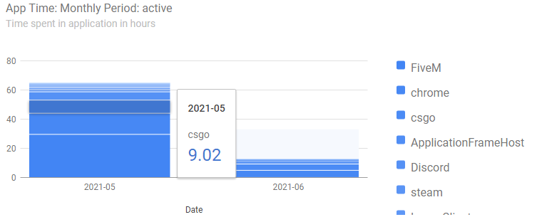
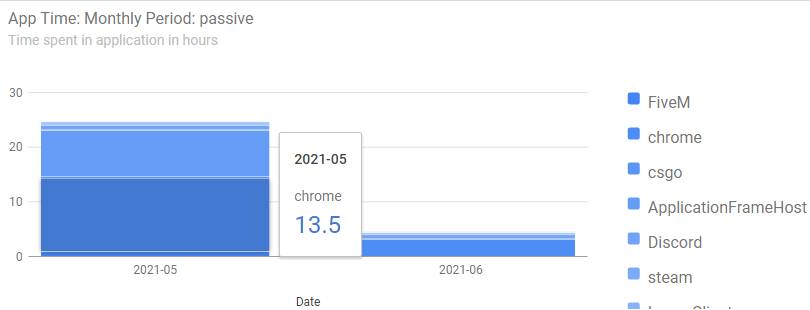
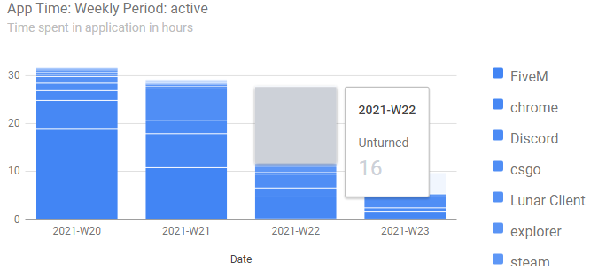
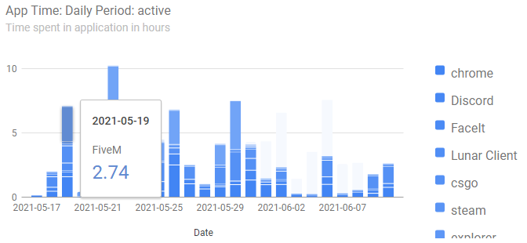
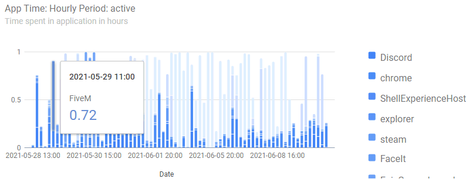

# KidMon

Utilities are intended as free open-source parental control tools to collect data about running applications to get info what apps are used and how long.
At desktop: The monitoring utility checks what application is running at foregroud and logs raw data horly to local disk in CSV format. The utility tries to split
case when user have in intarraction via keyboard or mouse and the sace when is passively watching monitor. Filtering out time when user is off computer helps
to enable screen saver. The raw data contain process name, i.e. file name with full path, which is not too human-friendly and might reveal disk structure to
unintended audience.

So the raw data are processed by another utility which applies set custom rules to translate process name and groups data to provide evaluatable results. The result are
placed in four CSV files, each for extra period - hourly, daily, weekly and monthly. The shorter period the recent data, the longer period the ancient data are in CSV. 
It limits CSV file size not to grow infinitely. The processing utility also inject the same CSV data into HTML template which provides charts. The Google Chart library
is used for rendering, i.e. unless library is cached locally, Internet connection is required. But no data are sent out of local machine.
Any CSV file can be also imported into a spreadsheed and evaluate, e.g. via contingention table. 

## Projects

### KidMon
It is Win32 (Windows 7/10) app running silently on background under user account and logging statistics hourly to CSV file. See [ReadMe.exe in project directory](./KidMon/ReadMe.txt) for more info.

### KidMonDude
Aggregation utility to make RRD .CSV fiels and .HTML charts using Google Charts. See [ReadMe.exe in project directory](./KidMonDude/ReadMe.txt) for more info.

### KidMonLib
Shared library files

### KidMonService
It was intended implementation as Windows service but it is undoable this way. So it is left here as service template.

### Test
Just a code to test various API functions.

## History

### v0.1
* initial KidMon release

### v0.2
* KidMonDude for data aggregation and charts
